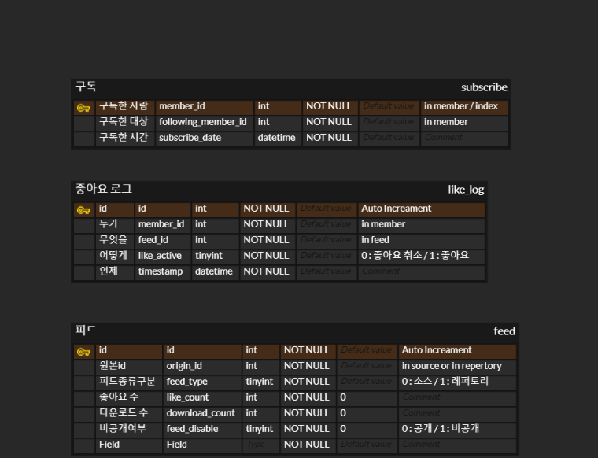
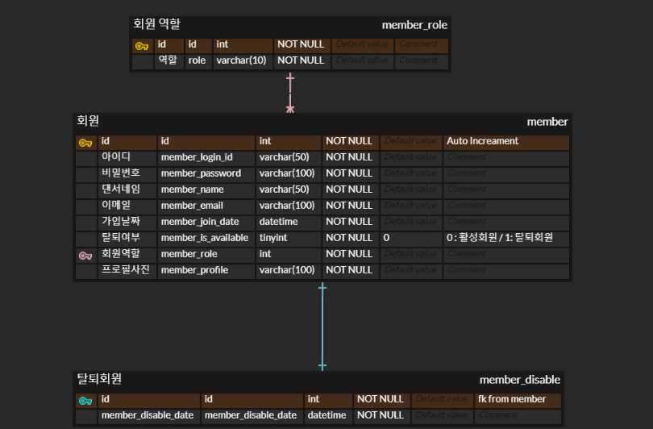
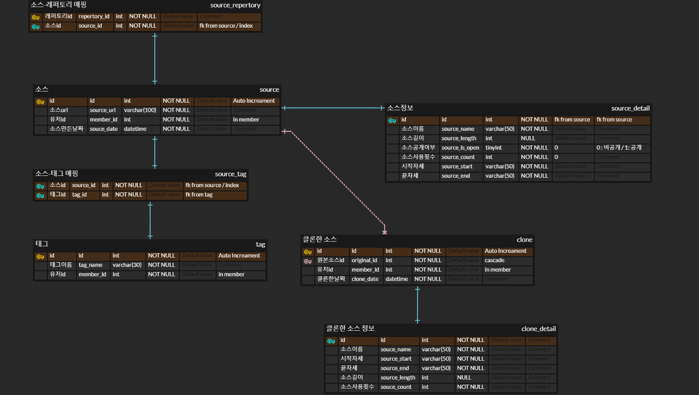

# Repertory

## 🔍 About
### 브레이킹 댄서들의 온라인 레파토리 수첩, Repertory입니다! <br>

1. 연습실에서 괜찮은 소스를 짜놓고 연결하지 못해서 그대로 잊어버리는 경우가 있다.
2. 수첩이나 메모장에 기록해도, 글만 보면 동작이 생각나지 않을 때가 있다.
3. 머리로 생각했을땐 괜찮은 흐름인데, 실제로 해보면 별로일 때가 많다.
4. 레파토리를 짜놓고 잊어버리는 경우도 있다.

이 불편한 점들을 해결할 좋은 방법이 없을까 생각하다가, 웹상에서 소스를 추출하고, 재배치해서 레파토리를 만들고, 소스와 레파토리를 모아서 관리하는 서비스가 있으면 좋겠다고 생각했고, 그게 저희 서비스인 **Repertory** 입니다. 

## 💥 주요 기능
### Repertory를 사용하면 ,,, 
1. 레파토리를 영상으로 쉽게 관리할 수 있다.
2. 소스를 잊어버리지 않고 보관할 수 있다.
3. 소스를 태그별로 분류하여 원하는 흐름의 레파토리를 짜기 용이하다
4. 레파토리를 미리 짜고, 느낌을 미리 볼 수 있다.
5. 다른사람의 소스도 내 레파토리에 적용해볼 수 있다.

## 📖 용어 사전
`레파토리` : 즉흥적으로 나오는 음악에 맞춰 추기위해서 미리 짜놓은 하나의 춤. 보통 40-50초 내외의 길이를 가진다. <br>
`소스` : 레파토리보다는 짧은 춤의 단위. 짧게는 1-2초가 될 수 있고, 길게는 10초이상이 될 수 있다. 소스가 모여 레파토리가 만들어진다.<br>
`프로젝트` : 레파토리를 만들고 있는 상태의 파일형식을 말한다. 아직 소스 추가, 삭제, 순서바꾸기가 자유로운 상태이지만 커뮤니티에 공유할 수 없는 상태 <br>
`시작자세, 끝자세` : 하나의 소스는 보통 시작하는 자세가 있고, 끝나는 자세가 있다. 두 개의 소스가 매끄럽게 이어지려면, 앞 소스의 끝자세와 뒷 소스의 시작자세가 일치하면 좋다.


## 💡 기능 설명
### 1. 영상편집
#### 1-a.  소스 생성
<br>

- 오른쪽 위 생성하기 버튼을 이용해서 프로젝트를 만들 수 있다. 
- 여기서 소스 만들기 탭에 들어가, 원하는 영상을 업로드하고, 재생 바를 이용해서 **구간을 설정**한다. 
- 원하는 곳에 재생바를 놓고 **Start**와 **End**를 눌러 구간을 설정하고, **Trim**을 누르면 원하는 구간이 잘려서 소스가 만들어진다.
#### 1-b. 소스 설정
<br>

- 소스를 생성하게 되면, 소스 이름과, 태그, 시작자세와 끝자세를 지정할 수 있다. 
- 이 자세들의 이름은 영상의 첫 프레임과 끝 프레임을 기준으로 **AI가 자동으로 인식하여 추천**해준다. 잘못 나왔을 경우에는 수정할 수 있다. 
- 생성한 소스는 왼쪽의 소스 목록에 들어가게 된다.
#### 1-c. 레파토리 제작
<br>

- 미리 제작해놓은 소스들을 작업대에 끌어다 놓으면, 소스가 추가된다. 
- 이 소스들은 **순서를 바꾸거나 다시 삭제**할 수 있다. 
- 배치해놓은 상태에서 재생을 누르면 그대로 재생이 된다.
#### 1-d. 레파토리 저장

- 레파토리 이름을 지정하고, 저장할 수 있다. 
- 레파토리는 더이상 수정할 수 없으며, 커뮤니티 기능을 통해서 다른 사람과 **공유**할 수 있다. 
- 공개/비공개 여부를 설정할 수 있다.


### 2. 커뮤니티
#### 2-a. 피드
 <br>

- 다른사람의 소스나 레파토리를 무작위로 볼 수 있다. 
- 특정 사용자를 **구독**하게 되면, 그 사용자의 영상들이 우선적으로 뜨게 된다. 
- 목록을 누르면 그 영상을 볼 수 있고, 내 보관함에 **저장**하거나, **좋아요**를 누를 수 있다.

#### 2-b. 소스 클론
- 다른 사용자의 소스를 저장하면, **내 소스 보관함으로** 들어오게 된다. 
- 소스 정보를 그대로 가져오고, 추후 내가 레파토리를 만들때 **사용**할 수 있다.

### 3. 기타 기능
 <br>
#### 3-a. 로그인

- **자체 로그인**과 **구글** 소셜로그인을 지원한다.

#### 3-b. 회원가입

- **정규식**을 이용해서, 아이디, 패스워드, 이메일 규칙을 설정해놓았다. 
- 댄서네임까지 모든 정보를 입력하면 회원가입이 진행된다.

## Architecture


## ER Diagram






## 🛠 Tech Stack 
|  역할 | 종류 |
| --- | --- |
| Backend Framework |   |
| Front Framework |   |
| Database |    |
| CI/CD |    |
| Version Control |   |
| Communication |  |
| Key Stack |    |


## 📦 How to Build


```
npm i
npm run build
```

## License
Repertory.online is [GNU](https://opensource.org/license/gpl-2-0/) Licensed


## 팀원 정보
|  김세진 | [김형진](https://github.com/HyeongjinKim98) | [안준현](https://github.com/alloy31) | [이성호](https://github.com/SunghoLee98) | [이주희](https://github.com/zoohee) | [최세은](https://github.com/ChoiSeEun) |
| --- | --- | --- | --- | --- | --- |
| FE | FE | 팀장, BE | BE | BE | BE |
| `커뮤니티`<br>`프로필` | `영상편집` | `발표`<br>`멤버서비스` | `프로젝트서비스`<br>`댄스서비스` | `CI/CD`<br>`커뮤니티서비스` | `DB설계`<br>`포즈감지서비스` |


